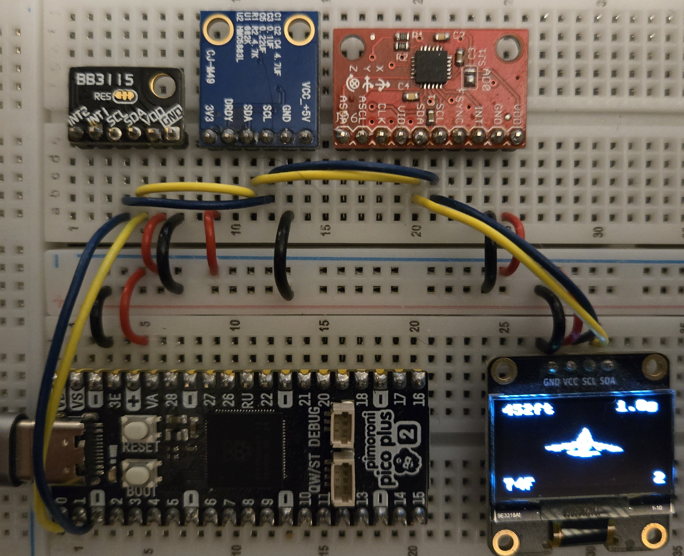

# 10DOF Pico HUD

[](https://github.com/K9DTV/10DOF/actions/workflows/ci.yml)   

Attitude HUD for a Raspberry Pi Pico or Pico 2. One I2C bus reads an MPU-9250-class accelerometer and gyro, an HMC5883L magnetometer, and an FXPQ3115 barometer, then draws a wireframe airplane on a 128×64 SSD1306.

The breadboard photo below is a Pimoroni Pico Plus 2, which uses the Pico 2 pinout. The same GP0/GP1 wiring works on a Pico or a Pico 2.



## What the display shows

`Plane_heading_3D.py` is the script that matches the photo.

| Corner | Example | Meaning |
| --- | --- | --- |
| Top left | `452ft` | Altitude in feet. Startup pressure is treated as 450 ft MSL. |
| Top right | `1.0g` | Specific force magnitude. |
| Bottom left | `74F` | Barometer temperature in degrees Fahrenheit. |
| Bottom right | `2` | Heading in degrees, 0–359. Zero is the compass direction at the end of startup. |
| Center | airplane | Wireframe, rotated by yaw, pitch, and roll. |

`10DOF.py` is an earlier cube sketch (temperature, raw pascals, heading). It needs `ssd1306.py` on the device. `MPU-92_68_9250.py` prints accelerometer, gyro, pitch, roll, and chip temperature and does not use the display. `Plane_heading_3D.py` talks to the OLED directly and does not need `ssd1306.py`.

## Hardware

Shared bus: I2C0, SDA = GP0 (physical pin 1), SCL = GP1 (physical pin 2). Power the modules from Pico 3V3 and GND. The firmware uses 3.3 V I2C levels.

| Device | Module in the photo | Address | Firmware |
| --- | --- | --- | --- |
| Accelerometer + gyro | Red MPU-9250-class board. AD0 low selects 0x68. | 0x68 | ±2 g, ±250 deg/s |
| Magnetometer | Blue CJ-M19 (HMC5883L) | 0x1E | 8-sample average, ±1.3 gauss, continuous |
| Barometer | Black BB3115 (FXPQ3115 / MPL3115-class) | 0x60 | Barometer mode, oversample 128 |
| Display | 0.96 in SSD1306, pins GND VCC SCL SDA | 0x3C | 128×64 |

`Plane_heading_3D.py` and `MPU-92_68_9250.py` run the bus at 100 kHz. `10DOF.py` uses 400 kHz.

The magnetometer breakout also labels `VCC_+5V` and `3V3`. Use the 3V3 pin with the Pico 3V3 rail. Leave the MPU `AD0` pin so the address stays 0x68.

Accepted MPU `WHO_AM_I` values are 0x70, 0x71, 0x73, 0x75, and 0x68. Clones often answer 0x75. The script continues even if the id is unexpected.

## Calibration

On each boot `Plane_heading_3D.py`:

1. Recovers a stuck I2C bus, then brings up the OLED, MPU, magnetometer, and barometer.
2. Asks you to hold the board still. It averages 200 gyro and accel samples and 40 barometer samples. That pressure is `p0`, mapped to 450 ft MSL (`HOME_ALT_FT`).
3. Loads `mag_cal.json` if each axis already spans at least 80 counts. Otherwise it runs a magnetometer calibration for 25 seconds: spin the board through a figure-8 until X, Y, and Z each cover that span. The result is written to `mag_cal.json` on the Pico filesystem.
4. Sets heading to 0 from the compass at the attitude captured during the still period, then starts the HUD.

To recalibrate the magnetometer, delete `mag_cal.json` on the Pico and reset. Yaw from the compass is blended in only while pitch and roll are inside ±12 degrees, so a steep attitude does not drag the heading.

Altitude on the HUD is the barometer height, smoothed, with a small vertical-acceleration term. It is a local offset from the 450 ft startup reference, not a surveyed field elevation. Change `HOME_ALT_FT` in `Plane_heading_3D.py` if you want a different field elevation.

## Load the script

Install MicroPython on the Pico or Pico 2, then copy `Plane_heading_3D.py` to the board as `main.py` (Thonny, or `mpremote cp Plane_heading_3D.py :main.py`). Reset and follow the on-screen calibration prompts.

`lib/hud_math.py` is the same math, without hardware, for the host tests. The three board scripts do not import it, so a single-file copy still runs.

## Tests

No board is required.

```bash
pip install -r requirements-dev.txt
make test
```

`tests/test_si.py` covers pascals, feet, metres, degrees Fahrenheit, g, and deg/s. `tests/test_python.py` covers the HUD math, the wireframe, the version, and the uploaded firmware sources. GitHub Actions runs both on pushes and pull requests to `main`.

## Version

Release **1.00.00**. See `CHANGELOG.md`.

## License

MIT. Copyright (c) 2026 James, K9DTV. See [LICENSE](LICENSE).
